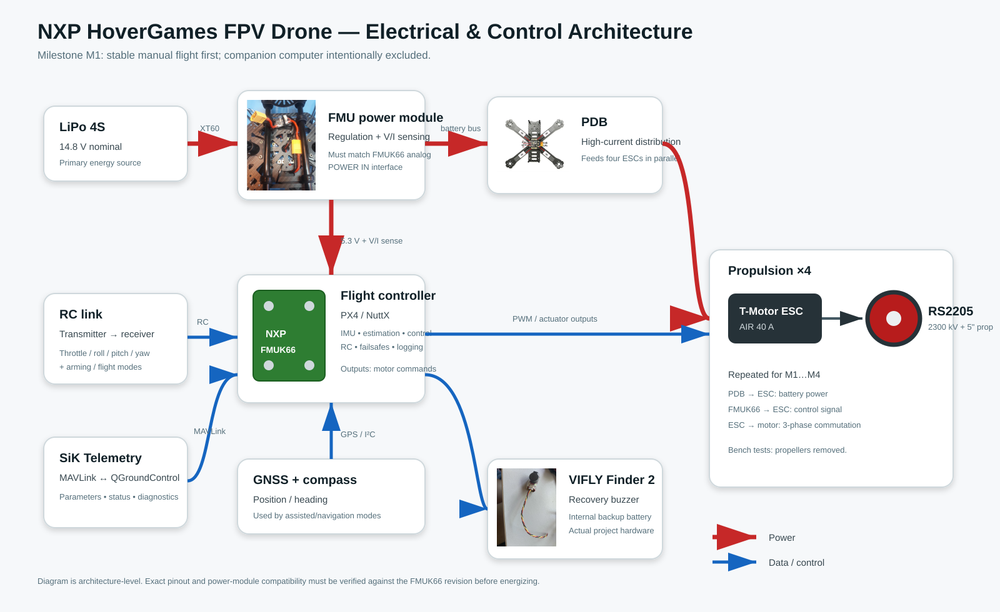

# NXP HoverGames FPV / Autonomous Drone

Engineering project based on the **NXP RDDRONE-FMUK66** flight management unit and **PX4 Autopilot**. The first milestone is intentionally conservative: build, wire, configure and validate a quadrotor that can be flown reliably with an RC transmitter. Computer vision and Raspberry Pi integration are planned only after the flight platform is validated.

## Engineering objectives

1. Rebuild a complete quadrotor around the FMUK66 and PX4.
2. Validate the power chain, ESC/motor mapping, sensor calibration and RC control.
3. Characterize mass, thrust margin, power consumption and failure modes.
4. Add telemetry and flight logging for repeatable tests.
5. Later: add a Raspberry Pi + camera as a companion-computer vision layer without compromising the real-time flight controller.

## Repository map

| Document | Purpose |
|---|---|
| [`docs/01_SYSTEM_OVERVIEW.md`](docs/01_SYSTEM_OVERVIEW.md) | System goal, architecture and milestones |
| [`docs/02_HARDWARE_SELECTION.md`](docs/02_HARDWARE_SELECTION.md) | Hardware choices, compatibility and open points |
| [`docs/03_ELECTRICAL_ARCHITECTURE.md`](docs/03_ELECTRICAL_ARCHITECTURE.md) | Power, signal paths and FMUK66 interfaces |
| [`docs/04_FLIGHT_PHYSICS.md`](docs/04_FLIGHT_PHYSICS.md) | Thrust, torque, control axes and sizing logic |
| [`docs/05_PX4_SOFTWARE.md`](docs/05_PX4_SOFTWARE.md) | PX4, QGroundControl, uORB and development workflow |
| [`docs/06_INTEGRATION_AND_TEST_PLAN.md`](docs/06_INTEGRATION_AND_TEST_PLAN.md) | Bring-up sequence and verification gates |
| [`docs/07_ENGINEERING_CHALLENGES.md`](docs/07_ENGINEERING_CHALLENGES.md) | Problems encountered, risks and engineering decisions |
| [`docs/08_REFERENCES.md`](docs/08_REFERENCES.md) | Official documentation, tutorials and useful resources |
| [`assets/diagrams/system_architecture.svg`](assets/diagrams/system_architecture.svg) | Electrical/control architecture diagram |

## Architecture

## Current milestone

**Milestone M1 — Manual flight:** RC transmitter -> receiver -> FMUK66/PX4 -> ESCs -> motors. Raspberry Pi and vision are explicitly outside M1.

## Safety

All bench tests are performed **without propellers** until motor assignment, direction, RC mapping, failsafes and arming behaviour have been verified. LiPo wiring and polarity are checked before power-up.

## Technical basis

The FMUK66 is the original HoverGames FMU and follows the Pixhawk FMUv4 architecture while using an NXP Kinetis K66 MCU. NXP's guide provides the reference assembly and connector pinouts; PX4 provides the flight stack and QGroundControl-based configuration workflow.
